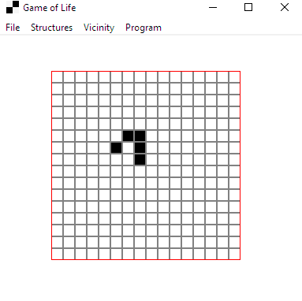
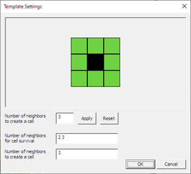

# Клеточный автомат "Игра Жизнь" (Game of Life)

Это курсовой проект, который представляет собой реализацию клеточного автомата "Игра Жизнь", разработанного британским математиком Джоном Хортоном Конвеем в 1970 году.

## Особенности

- Интерактивное поле 16x16
- Различные предустановленные структуры (глайдер, мигалка, звезда)
- Выбор типа окрестности (фон Неймана, Мура)
- Возможность создания пользовательской окрестности
- Автоматический и пошаговый режимы симуляции
- Настраиваемые параметры поля и отображения

## Как использовать

### Основное меню (File)

- **Set Default Map**: Очистить поле
- **Set Random Map**: Заполнить поле случайным образом
- **Make One Iteration**: Выполнить один шаг симуляции
- **Make A Lot Of Iterations**: Выполнить заданное количество итераций без визуализации
- **Run**: Запустить автоматическую симуляцию (каждые 500 мс)
- **Stop**: Остановить автоматическую симуляцию

### Создание структур (Structures)

В меню доступны опции для создания предустановленных структур:

- Мигалка (Blinker)
- Глайдер (Glider)
- Звезда (Star)

Для мигалки и глайдера можно выбрать начальное положение.

### Выбор окрестности (Vicinity)

Доступны следующие типы окрестностей:

- Фон Неймана (первого и второго порядка)
- Мура (первого и второго порядка)
- Пользовательская окрестность

Для выбора пользовательской окрестности есть специальное диалоговое окно.

### Дополнительные функции (Program)

- **Settings**: Настройка параметров поля (в том числе и размеры поля) и отображения
- **Info**: Информация о клеточном автомате
- **Help**: Описание пунктов меню программы
- **About Author**: Информация об авторе

## Автор

- GitHub: <https://github.com/R4zar0x>

## P.S

Обратите внимание, что программа находится в стадии активной доработки. В текущей версии могут присутствовать ошибки. Я работаю над улучшением и буду благодарен за любые сообщения о найденных багах или предложения по улучшению функциональности.
